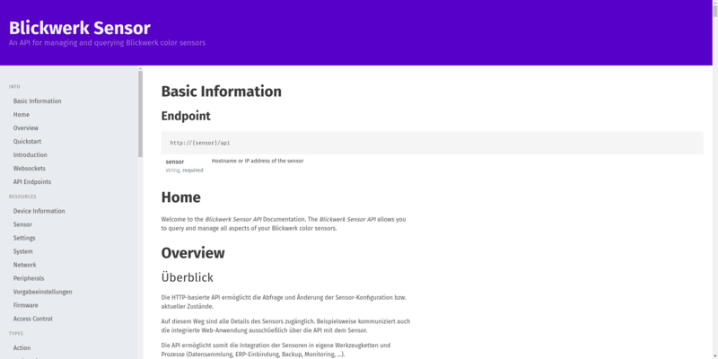
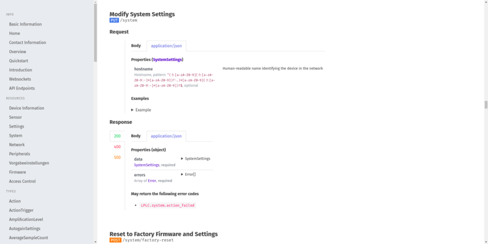

# raml2html werk theme

A [bulma](https://bulma.io/) and [open-color](https://yeun.github.io/open-color/) based single-page theme that is easily searchable and offline-ready.


 Example API                     | Example Request
:-------------------------------:|:-----------------------------------:
  | 

## General use

```sh
npm install raml2html-werk-theme
raml2html --theme raml2html-werk-theme --output output/docs.html --input docs.raml
```

**Note**: For some reason installing *raml2html-werk-theme* globally does not work. See [this issue](https://github.com/silicann/raml2html-werk-theme/issues/2) for progress on the situation. You can install both *raml2html* and *raml2html-werk-theme* as a local dependency and use `node_modules/.bin/raml2html --theme raml2html-werk-theme` to work around this problem for the time being.

**Note**: Use of the `--output` flag is required, because the theme bundles assets along with the HTML.

This theme is intended for general use and we would love to see others use it. That being said there are some caveats when using this theme that you should be aware of.

### REQUIRED raml2html version 

This theme requires raml2html v7.1.0+.

### Annotations

There currently is no general purpose rendering implementation for annotations. We’ve implemented what we needed but don’t feel that this scratches the surface of what people may want to use annotations for. If you use annotations and want to see better support in this theme please open up an issue and discuss your use case with us.

### Todos

There are still some things, that we’d like to implement (ordered by priority):

* Scroll-Spy support

  The menu on the left hand side is just static. Instead it should indicate the current menu-item, show sub-menus when scrolling the page and (in case of rather large api documentations) scroll with the content on the page.
  
* Better non-desktop media support

  Though we believe that most of the users that use API documentation will view them on HD displays, proper rendering on tablets and smartphones is desirable.
  
* Document search

  With all the meta-data from raml it should be possible to implement a more sophisticated search than the one the browser supports.
  
* Bookmarks

  With the help of WebStorage it should be possible to implement persistent bookmarks in order to easily navigate between often used resource/type definitions.

## Thanks

This theme is originally based on the existing sources of the [raml2html-default-theme](https://github.com/raml2html/default-theme) published by [@kevinrenskers](https://github.com/kevinrenskers). Learning how raml works and how things relate to each other would have been substantially harder hadn’t there been an already working theme implementation. 

## License
raml2html-werk-theme is available under the MIT license. See the LICENSE file for more info.
